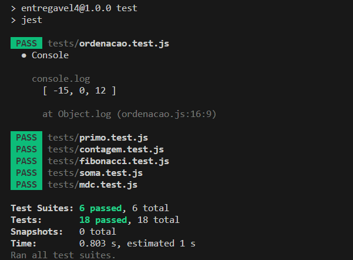

# Entregável 4 - Testes unitários 
Acesso e execução dos testes  
Abra o terminal e execute os seguintes comandos:  
<ul>
  <li>
    git clone https://github.com/matheusclima/entregavel4.git
  </li>
  <li>
    cd entregavel4
  </li>
  <li>
    cd entregavel4
  </li>
  <li>
    npm install
  </li>
  <li>
    npm test
  </li>
</ul>
 
<figure>
  
  <figcaption>
    Resultado obtido dos testes realizados.
  </figcaption>
  
</figure>

